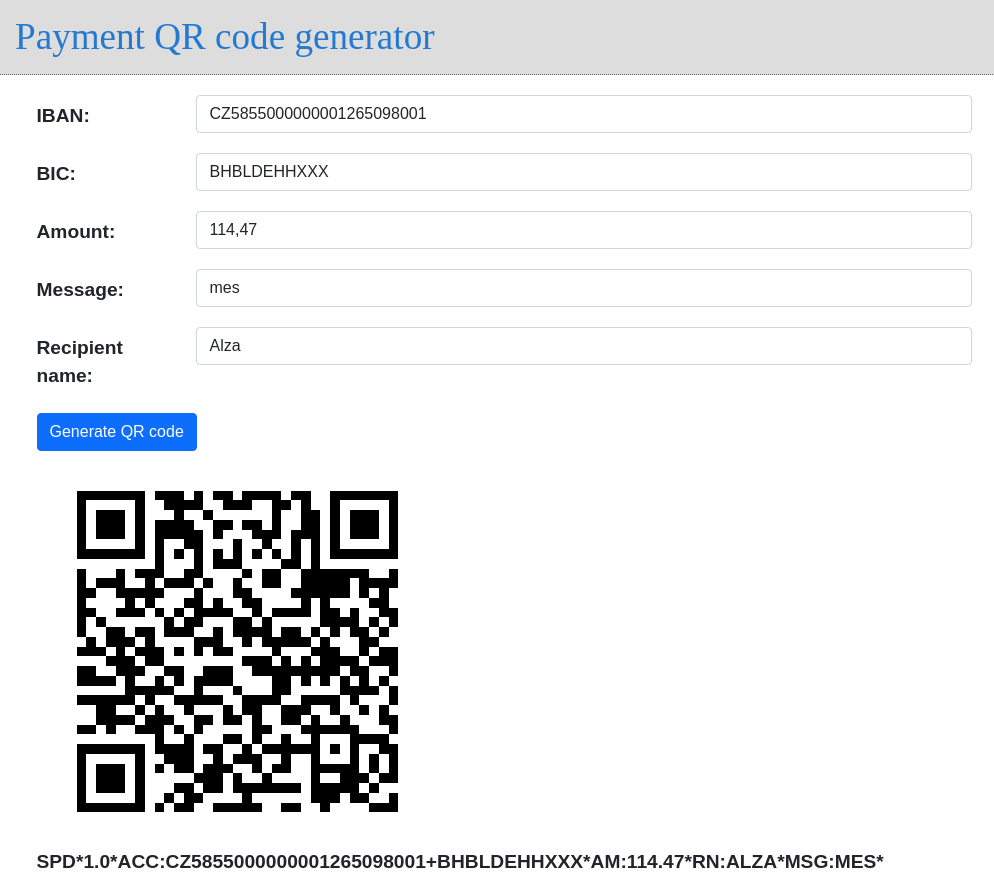

# Payment QR code generator

Standalone web server generating payment QR codes.

Supports [Short Payment Descriptor](https://en.wikipedia.org/wiki/Short_Payment_Descriptor) and
[EPC QR Code](https://en.wikipedia.org/wiki/EPC_QR_code) (SEPA) format.

## Instalation

    go get -u github.com/dundee/gdu/qrcode-payment-web

## Usage

* Start the QR code generator:

    $ ./qrcode-payment-web
    2021/04/02 00:41:01 using embed mode
    2021/04/02 00:41:01 Listening on 127.0.0.1:8080

* Open `127.0.0.1:8080` in your web broswer.
* Fill in payment details and submit.
* See the result QR code.

